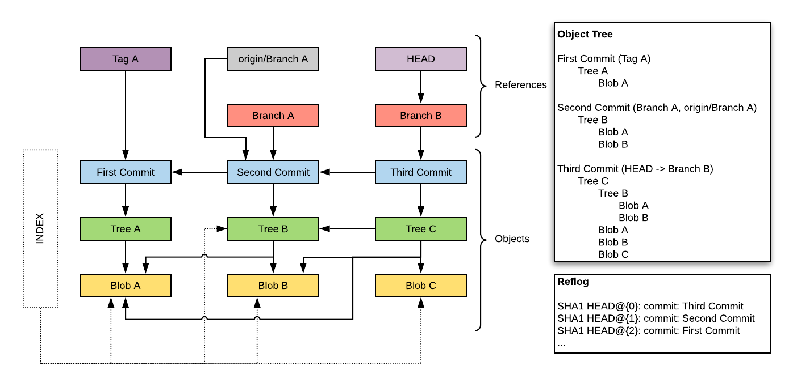

# Introduction

You can find this repo here: https://github.com/c9952594/Talk_GitInternals

**VSCode**

Going to use VSCode because it has:

- Git support
- Markdown support
- C# support
- File exploration
- Integrated terminals
- Image viewers

*More importantly it's my default IDE, ***it's awesome***, and I know the shortcuts*

**Shell**

I'm going to git-bash/shell because I prefer it when working with git.

```
C:\Program Files\Git\bin\sh.exe
```

There is nothing I'm doing in here that won't also work with your Command Line Interface of choice.

## My aim today

1. That you feel comfortable that you can't completely screw up a merge/rebase/etc.
2. That this diagram should make sense.



## Tooling

I've written an extension to dump out git information.

```
git alldetails
```

The extension will need to be our path.

```
PATH=`pwd`:$PATH
```

We can view use this in a differencing tool to see change of state.

```
cat right.txt > left.txt && git alldetails > right.txt
```

## Rough agenda

- Objects
  - Git init
    - Show files
  - First Commit (BlobA)
    - Show files
      - Focus on objects
    - cat-file 
      - Shows contents of the git database
      - -batch-check --batch-all-objects
      - -p
      - Blob
      - Tree
      - Commit
  - Second commit
    - ObjectCreator (C#)
      - Show Blob
      - Explain Tree / Commit
      - Export (Blob B)
    - Different trees / Same blobs
      - Blobs aren't files
      - Trees give context
      - Each commit has a tree
        - Each commit is complete
      - Differences aren't stored but calculated
    - Notice commit pointing at parent
      - This is the commit history
  - Third Commit
    - With subtree + new file (Blob C)
      - The tree file is built up just like a blob but with specific content
        - Same content = Same object
        - Same goes for commit
    - This means each unique file is immutable and has a different address
      - Content-Addressable filesystem
    - Commits point at parent
      - Directed-Acyclic graph
- Index
  - Notice staging before committing
  - What does this mean?
    - Alter the index file to store blobs
  - When you commit trees are made from index
  - Modified
    - Alter bak/BlobA
      - Notice the new hash
    - Stage
      - Old out / New in
    - Unstage
  - Untracked
    - Add new
      - Stage
      - Show blob
      - Unstage
      - Not removed
  - Deleted
    - Delete
      - Stage 
      - Commit
      - Notice objects aren't removed
        - Garbage collector
- Refs
  - Objects live seperate lives
  - How is anything found 
    - HEAD/heads
    - HEAD = Where you are
    - heads = Branches
  - Create dev branch
  - Diagram
    - HEAD -> Ref -> Commit
  - Don't do this for real but...
    - Edit HEAD
    - Edit Branch
  - Tags
    - tag name location
    - Change to ref: HEAD
  - Tag blob
- Logs
  - git reflog
    - Show HEAD, master, dev
  - You don't edit refs directly because of logs
  - git update-ref *ref file* *ref* -m *message*
- Merge
  - Look here: 
    - git merge --help
  - Cause a conflict
    - 1 = Base
    - 2 = Ours (current branch)
    - 3 = Theirs (other branch)
  - Resolve it
  - Reverse it
    - git reset HEAD~
      - soft: index/working area = untouched
      - mixed: reset index
      - hard: reset both
    - git clean -xfd
      - d: recurse
      - x: un-indexed
      - f: actually remove them
  - Recover merge
    - git reflog HEAD
      - Delete logs
    - git fsck --no-reflog
      - Checks all objects can be found in the object heirarchy from a reference
        - Reflog
        - Reference
          - heads
          - tags
    - git fsck --lost-found
- Rebase
  - Make history
    - Rebase dev to master
    - Undo it